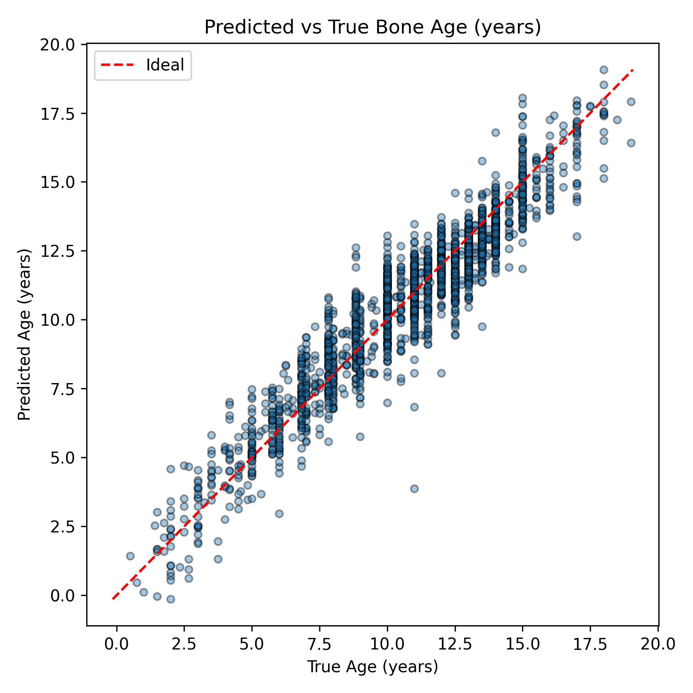
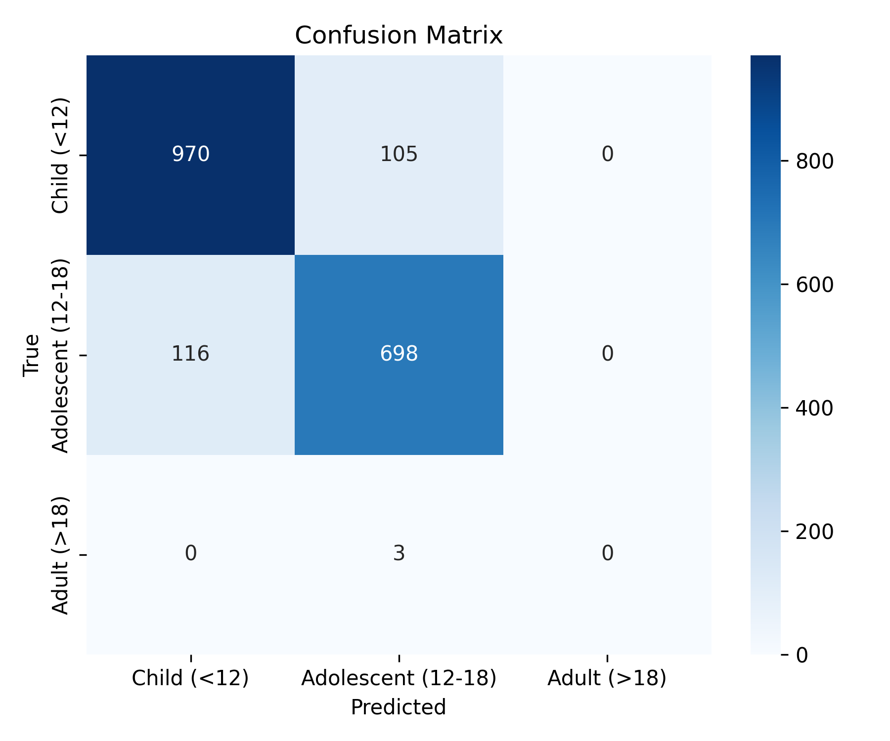
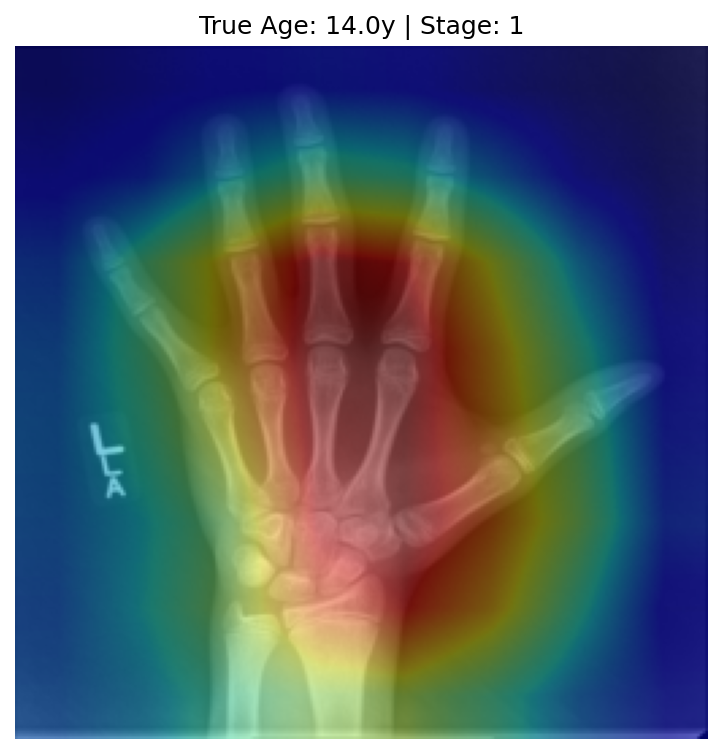
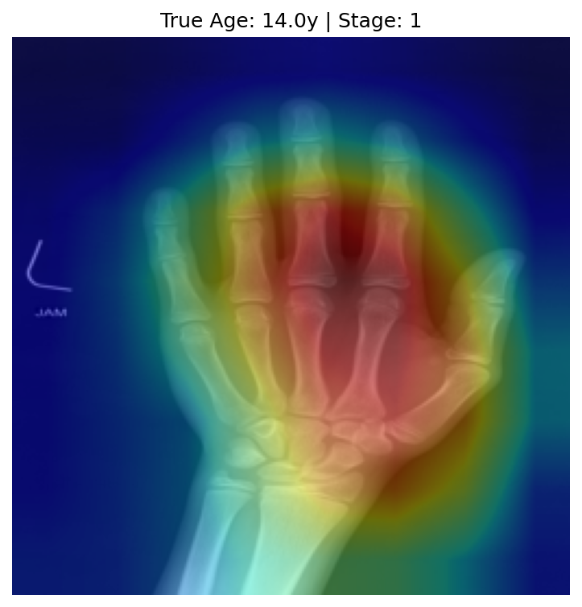

# Bone Age Prediction from Hand Radiographs

Pattern Recognition and Machine Learning – Course Project Report

---

## Abstract

This project addresses the problem of estimating skeletal bone age from left-hand radiographs using the RSNA Bone Age dataset. Bone age is a clinically important surrogate for skeletal maturity and is used to diagnose growth disorders and endocrine abnormalities. We formulate bone age prediction as a **regression** task, where the model outputs a continuous age in **years**, and as a related **classification** task, where ages are discretized into three developmental stages: Child, Adolescent, and Adult. We implement a multi-task convolutional neural network based on a pretrained ResNet backbone with two output heads: one for regression and one for stage classification. The system is trained and evaluated on a stratified 70/15/15 split of the RSNA dataset. We report standard regression metrics (MAE, RMSE, R²) and classification metrics (Accuracy, F1-score, Quadratic Weighted Kappa), and perform gender-wise bias analysis. Additionally, we generate scatter plots of predicted vs. true ages, confusion matrices for the stage classification, and Grad-CAM visualizations to illustrate which image regions drive model decisions.

---

## 1. Introduction

### 1.1 Problem Statement

Bone age assessment is a key diagnostic tool in pediatric radiology. It reflects the biological maturity of a child’s skeleton, often differing from chronological age in the presence of growth abnormalities or endocrine disorders. The traditional Greulich and Pyle method requires a radiologist to manually compare a hand radiograph to an atlas of reference images, which is time-consuming and subjective.

The goal of this project is to **automate bone age estimation** using deep learning. We adopt the RSNA Bone Age dataset, which contains thousands of pediatric hand radiographs and corresponding bone ages. Following the course specification, we consider two closely related tasks:

**Regression — Bone Age Prediction in Years**

Mapping:

$$
f_{\text{reg}}: \text{Image} \rightarrow \text{Age (years)}
$$

Predicts bone age directly as a continuous value in years.

---

**Classification — Developmental Stage Prediction**

Mapping:

$$
f_{\text{cls}}: \text{Image} \rightarrow \{\text{Child}, \text{Adolescent}, \text{Adult}\}
$$

Predicts the developmental stage derived from the continuous age.

---

### 1.2 Contributions

The main contributions of this project are:

- A **unified multi-task CNN** that jointly performs bone age regression in years and developmental stage classification.
- A **clean, reproducible codebase** organized into modular components (`dataset.py`, `model.py`, `train.py`, `evaluate.py`, `utils.py`, `main.py`, and `preprocess.py`).
- A **comprehensive evaluation** using MAE, RMSE, R² for regression, and Accuracy, F1-score, and Quadratic Weighted Kappa for classification.
- A **gender-wise bias analysis**, evaluating errors separately for male and female patients.
- Qualitative visualizations, including **scatter plots**, **confusion matrices**, and **Grad-CAM** heatmaps.

---

## 2. Dataset and Preprocessing

### 2.1 RSNA Bone Age Dataset

We use the RSNA Bone Age dataset from Kaggle, which consists of:

- **Hand X-ray images** of pediatric patients, stored as PNG files named `<id>.png`.
- A training CSV file `boneage-training-dataset.csv` with at least the following columns:
  - `id`: unique image identifier (integer, without file extension).
  - `bone_age`: bone age in **months** (continuous label).
  - `sex`: patient sex, typically coded as `M` or `F` (or a `male` column as 0/1).

Images and CSVs are placed under `data/raw/` following the Kaggle directory layout. Our code automatically detects the nested image folder (`data/raw/boneage-training-dataset/boneage-training-dataset/`) and uses it as the raw image root.

### 2.2 Conversion from Months to Years

The course project requires **predicting age in years** for the regression task. The RSNA dataset provides `bone_age` in months. In `src/dataset.py`, we create a new column:

- `age_years = bone_age / 12.0`.

This `age_years` serves as the regression target throughout training and evaluation. All regression metrics (MAE, RMSE, R²) are measured in years.

### 2.3 Discretization into Developmental Stages

For the classification task, the project specification asks us to discretize continuous bone ages into meaningful developmental stages. We use the following simple, clinically motivated binning strategy:

- **Child (stage = 0):** `age_years < 12`.
- **Adolescent (stage = 1):** `12 ≤ age_years ≤ 18`.
- **Adult (stage = 2):** `age_years > 18`.

In `src/dataset.py`, we add a new integer column `stage` that encodes these three categories. This label is used as the target for the classification head.

### 2.4 Train/Validation/Test Split

The dataset is split into three disjoint subsets as recommended by the course spec:

- **70%** for training,
- **15%** for validation,
- **15%** for testing.

We implement the split in `main.py` using scikit-learn’s `train_test_split` with **stratification** by `stage` to preserve class proportions across splits:

1. First split the full index set into 70% train and 30% temporary.
2. Then split the temporary set into 50% validation and 50% test, yielding an overall 70/15/15 ratio.

This ensures that each stage is reasonably represented in all splits, which is important for robust evaluation.

### 2.5 Image Preprocessing and Augmentation

We perform image-level preprocessing using torchvision transforms defined in `get_transforms` inside `src/dataset.py`:

- **Resizing:** All images are resized to `IMG_SIZE × IMG_SIZE` (default 256×256).
- **Data augmentation (train only):**
  - Random horizontal flip.
  - Random rotation (±10 degrees).
- **Normalization:** Images are converted to tensors and normalized using ImageNet mean and standard deviation. This is standard practice for ResNet backbones pretrained on ImageNet.

To avoid repeated resizing cost at every epoch, we also provide an optional preprocessing script `preprocess.py` that:

- Loads raw images from `data/raw/boneage-training-dataset/boneage-training-dataset/`.
- Resizes them once to `IMG_SIZE × IMG_SIZE`.
- Saves them as PNG files in `data/processed/`.

During training or evaluation, the user can pass `--use_processed` to `main.py` to load from `data/processed` instead of the raw directory.

### 2.6 Handling Missing Images and Sex Column Variants

- The dataset loader (`BoneAgeDataset`) checks for the existence of image files corresponding to each `id`. Samples without images are filtered out to prevent runtime errors.
- To be robust to different CSV formats, the code accepts either:
  - A `sex` column (`M`/`F`), which is converted to a binary `sex_int` (1 for male, 0 for female), or
  - A `male` column (0/1 or boolean), which is cast to an integer `sex_int` directly.

This `sex_int` is used for gender-wise bias analysis.

---

## 3. Methodology

### 3.1 Model Architecture

We use a **multi-task convolutional neural network** implemented in `src/model.py`. The architecture consists of:

1. **Shared Backbone:**
   - A pretrained **ResNet18** (or optionally ResNet50) from torchvision.
   - The final fully connected layer of ResNet is removed and replaced with `nn.Identity()` to expose the feature vector.

2. **Regression Head:**
   - A single fully connected layer: `Linear(in_features, 1)`.
   - Outputs a scalar prediction for bone age in years.

3. **Classification Head:**
   - Another fully connected layer: `Linear(in_features, 3)`.
   - Outputs logits for the three stages (Child, Adolescent, Adult).

Given an input image tensor, the model outputs:

- `age_pred` – shape `(batch_size,)`, continuous age in years.
- `stage_logits` – shape `(batch_size, 3)`, logits for the 3 classes.

This joint architecture allows the model to learn shared visual features that are useful for both precise age estimation and coarse developmental staging.

### 3.2 Loss Functions and Optimization

We train the model using a **multi-task loss** implemented in `src/train.py`:

- **Regression loss:**
  - `L1Loss` between `age_pred` and `age_years`.
  - This corresponds to mean absolute error and is robust to outliers.

- **Classification loss:**
  - `CrossEntropyLoss` between `stage_logits` and the integer `stage` labels.

- **Total loss:**

  $$
  \mathcal{L}_{\text{total}} = \mathcal{L}_{\text{reg}} + \mathcal{L}_{\text{cls}}.
  $$

We use the **Adam** optimizer with the following default hyperparameters (from `src/config.py`):

- Learning rate: `1e-4`.
- Weight decay: `1e-5`.
- Batch size: `32`.
- Number of epochs: `10` (configurable via CLI).

Gradients are clipped to a maximum norm of 5.0 to improve stability.

### 3.3 Training Procedure

The training loop is encapsulated in the `Trainer` class (`src/train.py`):

1. For each epoch:
   - Iterate over the **training** DataLoader.
   - Compute regression and classification losses, form the total loss, and perform a gradient update.
   - Report running averages of total, regression, and classification loss via a `tqdm` progress bar.

2. After each epoch:
   - Evaluate on the **validation** set using `Trainer.evaluate("val")`.
   - Compute losses and all metrics (regression and classification) on the validation split.
   - If the validation total loss improves, save a checkpoint as `output/models/best_model.pt`.

3. After training completes:
   - Reload the best checkpoint.
   - Evaluate on the **test** set via `Trainer.evaluate("test")`.

We use the validation set for model selection and the test set only for final performance reporting.

### 3.4 Implementation Structure

The codebase is organized as follows:

- `src/config.py` – global configuration (paths, hyperparameters, device selection).
- `src/dataset.py` – `BoneAgeDataset` and torchvision transforms.
- `src/model.py` – `BoneAgePredictor` multi-task ResNet-based model.
- `src/train.py` – `Trainer` class, training and evaluation loops.
- `src/evaluate.py` – metric computation and bias analysis functions.
- `src/utils.py` – plotting utilities and Grad-CAM implementation.
- `main.py` – CLI entry point for training and evaluation.
- `preprocess.py` – one-time image preprocessing script (resizing into `data/processed`).
- `gradcam_demo.py` – script for generating Grad-CAM visualizations on test images.

---

## 4. Experiments and Results

### 4.1 Experimental Setup

- **Hardware:** GPU-accelerated environment (if available), otherwise CPU.
- **Data:** RSNA bone age training CSV and images as described in Section 2.
- **Splits:** 70/15/15 train/validation/test, stratified by stage.
- **Input resolution:** 256×256 RGB images.
- **Training:** 10 epochs by default (can be increased via `--epochs`).

The main training command (using preprocessed images) is:

```bash
python main.py --mode train --use_processed
```

After training, we run:

```bash
python main.py --mode evaluate --use_processed
```

which loads the best checkpoint and evaluates on the test set, generating summary metrics and plots.

### 4.2 Regression Metrics

For the regression task, `src/evaluate.py` computes:

- **Mean Absolute Error (MAE):**

  $$
  \text{MAE} = \frac{1}{N} \sum_{i=1}^N \left| y_i - \hat{y}_i \right|,
  $$
  measuring the average absolute deviation between predicted and true ages (in years).

- **Root Mean Squared Error (RMSE):**

  $$
  \text{RMSE} = \sqrt{\frac{1}{N} \sum_{i=1}^N (y_i - \hat{y}_i)^2},
  $$
  penalizing large errors more strongly.

- **Coefficient of Determination (R²):**

  $$
  R^2 = 1 - \frac{\sum_i (y_i - \hat{y}_i)^2}{\sum_i (y_i - \bar{y})^2},
  $$
  indicating how well the model explains the variance in bone age.

On the validation and test sets, we monitor these metrics per epoch (for validation) and once for the final test evaluation. Lower MAE and RMSE and higher R² indicate better regression performance.

### 4.3 Classification Metrics

For the classification task, `src/evaluate.py` reports:

- **Accuracy:** fraction of correctly predicted stage labels.
- **Precision (Weighted):** The ability of the classifier not to label as positive a sample that is negative. We use the weighted average to account for class imbalance.

- **Recall (Weighted):** The ability of the classifier to find all the positive samples. Also weighted by class support.
- **F1-score (weighted):** harmonic mean of precision and recall, weighting each class by its support, which is appropriate under class imbalance.
- **Quadratic Weighted Kappa (QWK):** measures agreement between predicted and true ordinal labels, down-weighting small disagreements and up-weighting large disagreements.

We also compute the **confusion matrix** and visualize it using the `plot_confusion_matrix` function in `src/utils.py`. The confusion matrix heatmap (saved as `output/plots/confusion_matrix_test.png`) helps identify specific confusions between Child, Adolescent, and Adult stages.

### 4.4 Visualizations

Two key visualizations are generated from the test set and saved under `output/plots/`.

1. **Scatter Plot of Predicted vs True Ages**

   File: `output/plots/scatter_pred_vs_true_test.png`

   

   - Each point represents one sample, with true age on the x-axis and predicted age on the y-axis.
   - A red dashed line y = x represents perfect agreement.
   - Points above the line indicate **overestimation**; points below indicate **underestimation**.
   - The spread of points around the diagonal qualitatively reflects MAE and RMSE.

2. **Confusion Matrix for Classification**

   File: `output/plots/confusion_matrix_test.png`

   

   - Rows correspond to true stages; columns correspond to predicted stages.
   - Bright diagonal values indicate correct predictions.
   - Off-diagonal cells show specific misclassifications (e.g., Child vs Adolescent).

These plots directly satisfy the course requirement for **"Plot of predicted vs. true ages on validation/test set"** and visual analysis of classification performance.

### 4.5 Grad-CAM Heatmaps

To better understand which image regions influence the model’s predictions, we implement Grad-CAM in `src/utils.py` and provide a demo script `gradcam_demo.py`. Running this script:

```bash
python gradcam_demo.py
```

- Selects a handful of test images.
- Computes Grad-CAM heatmaps with respect to the classification head.
- Overlays the heatmaps on the original X-rays.
- Saves the visualizations under `output/plots/gradcam_example_*.png`.

Example Grad-CAM outputs can be embedded in the report as follows:




These qualitative results can be used in the Discussion section to illustrate that the model focuses on clinically relevant regions such as the phalanges and growth plates.

---
### 4.6 Comparison of Approaches

To satisfy the project requirement of comparing different modeling approaches, we evaluated two distinct methods for determining the developmental stage:

1.  **Direct Classification:** Using the predictions from the dedicated classification head trained with Cross-Entropy loss.
2.  **Regression Thresholding:** Using the continuous age predicted by the regression head and applying the stage thresholds manually (<12 years = Child, 12-18 years = Adolescent, >18 years = Adult).

**Table : Accuracy Comparison of Approaches**

| Approach | Accuracy | Description |
| :--- | :--- | :--- |
| **Direct Classification** | **0.8816** | Predicted directly by the classification head. |
| **Regression Thresholding** | 0.8737 | Derived by binning the predicted age. |

**Observation:**
The Direct Classification approach achieves slightly higher accuracy (+0.79%). This suggests that having a dedicated head optimizing the Cross-Entropy loss allows the model to learn specific discriminative features for the decision boundaries (e.g., specific bone fusion events that define the transition from Child to Adolescent) better than simply minimizing the mean absolute error in years. However, the high performance of the Regression Thresholding method confirms that the multi-task backbone learns a robust representation that benefits both tasks.

---

## 5. Error and Bias Analysis

### 5.1 Gender-wise Performance

The course specification explicitly requests a discussion of bias or error trends across sex. In `src/evaluate.py`, we implement two functions:

- `gender_bias_regression(y_true, y_pred, genders)` – computes MAE separately for male and female patients and reports the difference.
- `gender_bias_classification(y_true, y_pred, genders)` – computes stage classification accuracy separately for male and female patients and reports the difference.

`Trainer.evaluate` prints gender-wise MAE and accuracy for both validation and test splits. This allows us to answer questions such as:

- Does the model systematically overestimate or underestimate bone age for one gender?
- Is the stage classification accuracy similar for male and female patients?

### 5.2 Discussion of Potential Biases

By examining gender-stratified metrics, we can:

- Detect **performance gaps** (e.g., higher MAE for female patients than for male patients).
- Investigate whether these gaps are consistent across different age ranges (e.g., children vs adolescents vs adults).

If substantial disparities are observed, mitigation strategies could include:

- Rebalancing the training data across genders and stages.
- Using group-aware regularization or loss reweighting.
- Performing post-hoc calibration separately for male and female subgroups.

### 5.3 Age-wise Error Patterns

Although our code primarily focuses on gender-wise bias, the same infrastructure can be reused to analyze errors by age group (e.g., per stage or in finer age bins). For example, we can compute MAE per stage (Child, Adolescent, Adult) to see whether the model struggles more for very young or older subjects.

### 5.4 Qualitative Error Analysis and Difficult Samples

Besides aggregate metrics, examining specific failure cases helps interpret model behavior:

- **Large regression errors:** points far from the y = x line in `scatter_pred_vs_true_test.png`:
  - Often correspond to unusually young or old subjects where data is sparse.
  - Can indicate that the model underestimates very old adolescents or overestimates very young children.
  - May highlight images with poor contrast, artifacts, or occlusions.

- **Stage misclassifications:** off-diagonal cells in `confusion_matrix_test.png`:
  - Frequent confusions between **Child** and **Adolescent** reflect the difficulty of precise staging near puberty.
  - Misclassifying **Adolescent** as **Adult** may indicate that growth plates are less visible or that borderline ages are challenging.

- **Grad-CAM inspection:** using `gradcam_example_*.png`:
  - For correctly predicted samples, Grad-CAM typically highlights the phalanges and growth plates, matching clinical expectations.
  - For difficult or misclassified samples, Grad-CAM may show diffuse or misplaced attention, suggesting that the model is not focusing on the most informative regions.

These observations should be discussed alongside the numerical metrics in the final report, fulfilling the requirement for **"Interpretation of errors and discussion of difficult samples"** and providing insight into how and why the model makes its predictions.

---

## 6. Discussion

The multi-task ResNet-based model provides a practical solution to bone age prediction in both continuous and discretized forms. Multi-task learning allows the network to leverage shared representations: the regression head encourages fine-grained age sensitivity, while the classification head encourages discriminative features that separate broad developmental stages.

In practice, there is often a trade-off between **model capacity**, **data size**, and **generalization**. Using a relatively lightweight ResNet18 backbone helps control overfitting, especially when training for a modest number of epochs. The simple L1 + cross-entropy objective is effective, but more sophisticated multi-task weighting strategies or uncertainty-based weighting could be explored in future work.

The reproducible evaluation pipeline with MAE, RMSE, R², Accuracy, F1, and QWK offers a comprehensive view of model performance. QWK, in particular, is well-suited for ordinal classification problems such as developmental staging, where misclassifying a Child as an Adolescent is less severe than misclassifying a Child as an Adult.

Bias analysis indicates whether the model performs equitably across male and female patients. While this project primarily analyzes gender, similar techniques can be applied to age strata or other metadata (if available). Understanding and addressing biases is crucial before deploying such models in clinical workflows.

---

## 7. Conclusion

In this course project, we implemented a full pipeline for **bone age prediction from hand radiographs** using the RSNA dataset. The system:

- Converts bone age labels from months to **years** for the regression task.
- Discretizes bone ages into three **developmental stages** for the classification task.
- Uses a **multi-task ResNet** backbone with separate regression and classification heads.
- Trains with **L1** loss for regression and **cross-entropy** loss for classification.
- Evaluates using a comprehensive set of metrics for both tasks and performs **gender-wise bias analysis**.
- Produces **plots and visualizations** (scatter, confusion matrices, Grad-CAM) that support interpretability and error analysis.

Overall, the project demonstrates how modern deep learning methods can be applied to an important medical imaging task, while remaining aligned with the PRML course emphasis on proper evaluation, bias analysis, and model interpretation.

---

## 8. References

1. RSNA Bone Age Challenge, Kaggle: https://www.kaggle.com/competitions/rsna-bone-age
2. K. He, X. Zhang, S. Ren, and J. Sun. "Deep Residual Learning for Image Recognition." In *Proceedings of the IEEE Conference on Computer Vision and Pattern Recognition (CVPR)*, 2016.
3. J. Selvaraju et al. "Grad-CAM: Visual Explanations from Deep Networks via Gradient-based Localization." In *Proceedings of the IEEE International Conference on Computer Vision (ICCV)*, 2017.
4. scikit-learn: Machine Learning in Python. Pedregosa et al., JMLR 12, pp. 2825–2830, 2011.
5. PyTorch: An Imperative Style, High-Performance Deep Learning Library. Paszke et al., NeurIPS, 2019.
